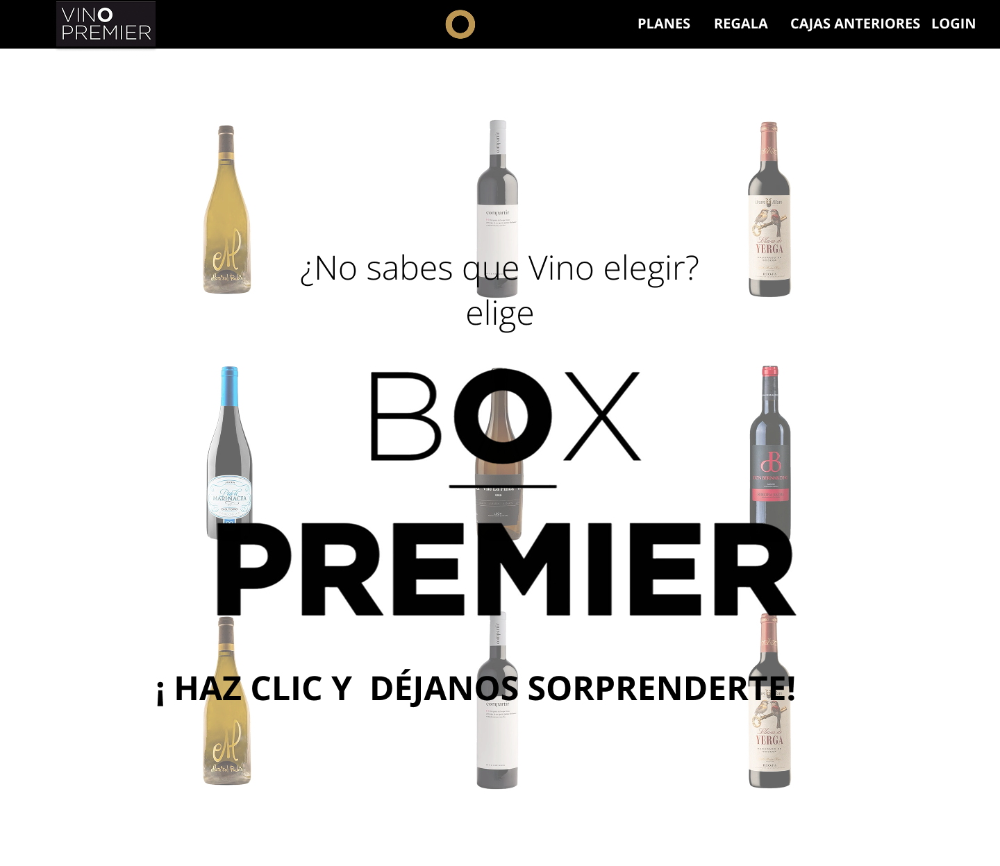

# 🍷 **BoxPremier — servicio de suscripción de vinos**

*"Cada botella es una nueva historia que merece ser descubierta."*

**BoxPremier** es una plataforma fullstack donde los usuarios pueden suscribirse a vinos para ellos mismos o como regalo.    
El proyecto combina una interfaz intuitiva, sistema de autenticación, perfil de usuario y panel de administración para gestionar pedidos y usuarios.

El objetivo principal es **hacer que la cultura del vino sea accesible, estética y placentera para todos.**


## 🌌 **Descripción del proyecto**

<p align="center">
  
  
  
</p>

**BoxPremier** ofrece a los usuarios:    
* Suscripción a selecciones de vinos para todos los gustos.    
* Posibilidad de realizar una suscripción como regalo.    
* Visualización de cajas de vinos anteriores.    
* Perfil de usuario para gestionar perfil y pagos.    
* Registro sencillo y rápido.    
* Panel de administración para gestionar clientes y pedidos.

El diseño está inspirado en la atmósfera de bodegas y catas europeas — tonos suaves, enfoque en comodidad visual y atención al detalle.

## 🧭 **User Journey**

1. **Página principal** — información sobre suscripciones, promociones y vinos del mes.    
2. **Registro / Inicio de sesión** — creación de cuenta personal.    
3. **Suscripción** — elección del plan y configuración de envío.    
4. **Perfil de usuario** — gestión de subscripciones y dirección.    
5. **Suscripción de regalo** — selección del box para regalo.    
6. **Panel de administración** — gestión de usuarios, pedidos y pagos.

## 🎨 **Prototipo en Figma**

La interfaz se realiza en un estilo minimalista con elementos burdeos y acentos dorados.    
Todas las pantallas están adaptadas para escritorio y dispositivos móviles.

[🎨 Ver prototipo en Figma](https://www.figma.com/design/3ZeYk0wkh0OYuk07WEdjF1/Box-Premier?node-id=134-2&p=f&t=YANXJNEMWVj8JvyT-0)


## ⚙️ **Tecnologías**

* ⚛️ **React + Vite** — framework moderno de frontend    
* 🧭 **React Router** — enrutamiento    
* 💅 **TailwindCSS** — estilización y diseño responsivo    
* 🧩 **Zustand / AuthStore** — gestión de estado y autenticación    
* 🔧 **Axios** — interacción con API    
* 🧱 **Arquitectura modular** — estructura limpia del código    
* 🧪 **Jest / React Testing Library** — pruebas de componentes

## 📁 **Estructura del proyecto**

```bash
boxpremier-client/
│
├── public/               # Recursos públicos (iconos, logos)
├── server/               # Parte del servidor / mock backend
│   └── db.json
│
├── src/
│   ├── assets/           # Imágenes y archivos estáticos
│   ├── components/       # Componentes UI reutilizables
│   ├── layout/           # Diseño principal
│   ├── pages/            # Páginas de la aplicación
│   │   ├── admin/        # Panel de administración
│   │   ├── Home.jsx
│   │   ├── MainPage.jsx
│   │   ├── ProfilePage.jsx
│   │   └── SubscriptionPage.jsx
│   ├── router/           # Enrutamiento
│   ├── services/         # Trabajo con API
│   ├── store/            # Almacenamiento de estado
│   ├── tests/            # Pruebas
│   ├── utils/            # Utilidades
│   ├── validators/       # Validación de datos
│   ├── main.jsx
│   └── index.css
│
├── .env
├── vite.config.js
├── eslint.config.js
├── package.json
└── README.md
```

## ⚡ **Instalación y ejecución**

```bash
# 1. Clonar el repositorio
git clone https://github.com/boxpremier/boxpremier-client.git
cd boxpremier-client

# 2. Instalar dependencias
npm install

# 3. Ejecutar el proyecto
npm run dev
```

🛰️ Frontend → http://localhost:5173  

## 🧪 **Pruebas**

Ejecutar pruebas:

```bash
npm run test
```

Se prueban:

* Autenticación
* Gestión de suscripciones
* Endpoints de API
* Componentes UI

## 🗂️ **Gestión del proyecto**

El trabajo del equipo se organizó mediante GitHub Projects.  
Se utilizaron tareas, etiquetas y tablero Kanban para seguimiento del desarrollo y pruebas.  
Cada miembro fue responsable de un módulo específico: frontend, diseño, API y documentación.

## 👥 **Equipo del proyecto**

| Nombre | Rol | GitHub | LinkedIn |
|--------|-----|--------|----------|
| Mariany | Developer| [GitHub](https://github.com/marianyarj) | [LinkedIn](https://www.linkedin.com/in/mariany-araujo/) |
| Priscelis| Developer | [GitHub](https://github.com/priscelis) | [LinkedIn](https://www.linkedin.com/in/priscelis-codrington-5195b0206/) |
| Larysa | Developer | [GitHub](https://github.com/ambalari) | [LinkedIn](https://www.linkedin.com/in/larysa-ambartsumian/) |
| Nicole | Developer | [GitHub](https://github.com/nicolegugu93) | [LinkedIn](https://www.linkedin.com/in/nicoleguevaragutierrez/) |
| Ingrid | Developer | [GitHub](https://github.com/ingridD2707) | [LinkedIn](https://www.linkedin.com/in/ingrid-m/) |
| Anngy | Developer | [GitHub](https://github.com/angiepereir) | [LinkedIn](https://www.linkedin.com/in/anngy-pereira-094aa026a/) |

Proyecto creado como parte del bootcamp de desarrollo web  **BoxPremier Team**.  
Diseño, código y arquitectura realizados con atención al detalle y amor por el vino 🍇